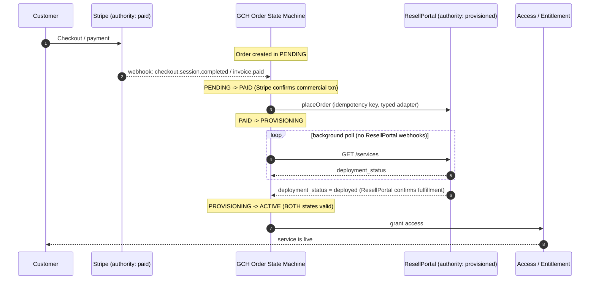

# Authority Boundaries

GCH-ALEPH is deliberately built as an **orchestrator**, not a system of record for
money or fulfillment. Three external authorities each own exactly one slice of the
truth, and GCH is forbidden from re-deciding any of it. This document defines those
boundaries and the cardinal rule that binds them together.

## The three-authority model

| Authority | Owns | Represents | GCH may... | GCH may NOT... |
| --- | --- | --- | --- | --- |
| **Stripe** | The commercial transaction | *paid* — money has been committed | Read webhook events, mirror invoices/subscriptions by external id, react to payment state | Decide whether a payment is valid, charge, refund outside Stripe, or treat a local flag as proof of payment |
| **ResellPortal** | Fulfillment | *provisioned* — the hosting service actually exists | Place an order, poll `GET /services` for deployment status, mirror the order by external id | Declare a service "deployed" without ResellPortal confirming it, or duplicate its billing/service records as authority |
| **GCH** | Orchestration / access-grant | *entitled* — access is granted | Run the order state machine, grant/revoke access, coordinate the two systems above, audit every action | Confirm payment, confirm fulfillment, or grant access before **both** upstream states are valid |

Stripe answers "was this paid?". ResellPortal answers "does the service exist?".
GCH only answers "should this account have access right now?" — and it may only
answer *yes* when both upstream authorities have already answered *yes*.

## Cardinal rule (verbatim)

> Stripe confirms the commercial transaction; ResellPortal confirms fulfillment;
> GCH grants access only after BOTH states are valid.

Every design decision, adapter, and state transition in this platform must be
reconcilable with that sentence. If a code path could grant access with only one of
the two upstream confirmations, that code path is wrong.

## Consequences of the model

- **No duplicated authority.** GCH mirrors upstream records *by external id*
  (`stripeInvoiceId`, `resellPortalOrderId`, `fossbillingClientId`) and never treats
  its local copy as the source of truth. Local rows are a cache/ledger, not the ledger.
- **Deterministic, idempotent coordination.** Because two independent authorities are
  being reconciled with retries and polling, every mutating external call carries a
  deterministic idempotency key (see [IDEMPOTENCY.md](./IDEMPOTENCY.md)).
- **Adapters only.** Each authority is reached exclusively through a typed adapter
  class — no raw `fetch`/`axios` in service files. This keeps the boundary explicit
  and mockable.
- **One paid order line → at most one active provider service**, enforced as a
  DB-level unique constraint, so a retry or webhook replay can never fan out into
  duplicate provisioning.

## Happy-path order lifecycle

The transition into `ACTIVE` — the only state in which access is granted — is
reachable **only** after Stripe has confirmed *paid* and ResellPortal has confirmed
*provisioned*. That is the cardinal rule expressed as a state machine.

## State reference

| State | Meaning | Entry condition |
| --- | --- | --- |
| `PENDING` | Order recorded, awaiting payment | Order created |
| `PAID` | Stripe confirmed the commercial transaction | Verified Stripe webhook |
| `PROVISIONING` | Fulfillment requested, awaiting confirmation | ResellPortal order placed |
| `ACTIVE` | Access granted | ResellPortal reports `deployed` **and** payment still valid |

Failure/compensation states (e.g. `FAILED`, `REFUNDED`, `SUSPENDED`) hang off this
spine and are defined alongside the order state machine implementation; none of them
grant access.
